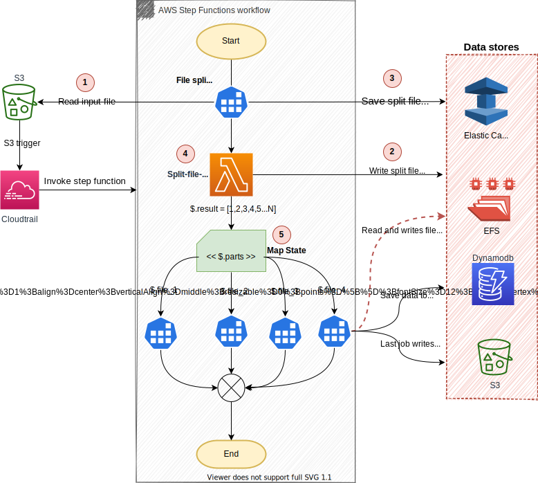
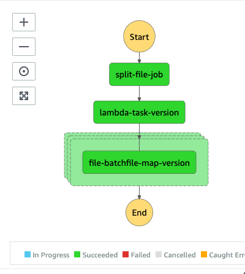
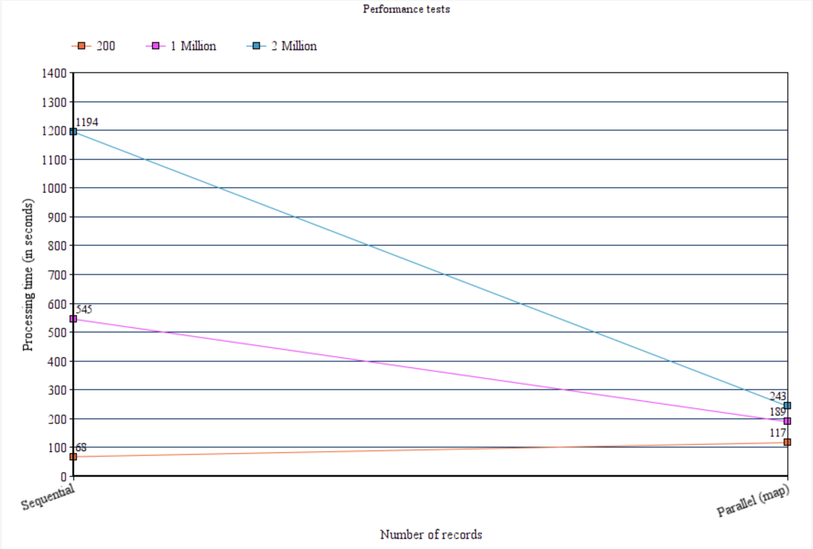
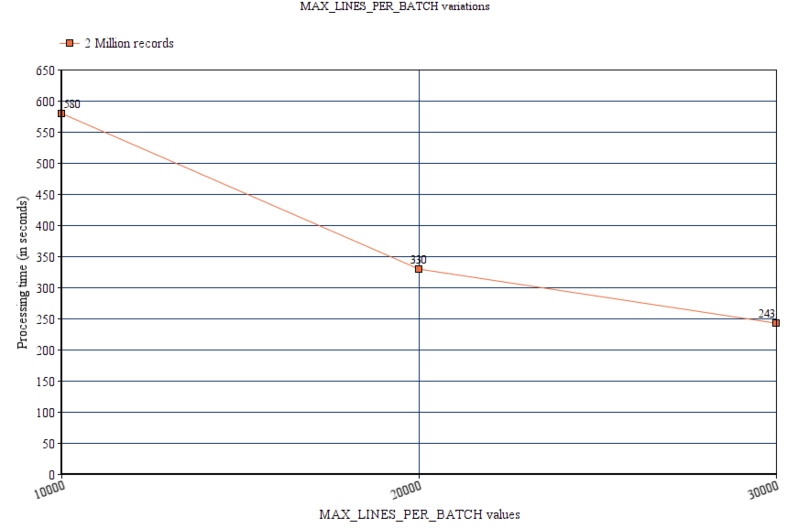

# Batch processing in scale using K8s jobs and step functions

This article talks about an approach that can help customers scale large file processing workloads in AWS EKS using Kubernetes jobs and AWS step functions.

## Introduction

This approach uses AWS step functions to orchestrate the end to end flow, which involves:

* Reading of the input file from AWS S3
* Splitting the large input file into smaller files, processing it, saving the data into a database
* Writing the output file to AWS S3

Before we get into the implementation details, let us discuss the alternative approach to address the same use case.

* Sequential read (aka single-threaded) - This approach uses a simple file reader that reads the large file row by row and processes it.
* Big data system (using spark) - This approach is quite popular and commonly implemented when it comes to processing large files. It uses spark api's like `spark.csv.read()` to read the file, convert them into dataframes or RDD, process them and write the data back into to a data lake as CSV, txt or parquet files
* Stream-based system (using message bus) - In this approach, a program reads the file row by row and pushes the records as individual messages to a message bus (like `Kafka` or `AWS Kinesis streams`). A consumer (like AWS Lambda)  reads the message, processes it, and stores the result in a file system or database

> Note: Let us assume a large file, in this case, refers to a file with at least one million records, delimited by line breaks (with each row presenting a single record)

Here is a relative comparison of these approaches:

| Name  | Description | Sequential read (#1) | Big data system (#2) | Stream-based system (#3) |
| ----- | ------------- | ----- | ---- | ----- |
| Row order | Can the output file be generated in the same row order as input file | Yes | No | No |
| Horizontal scaling | Will horizontal scaling help? | No | Yes | Yes |
| Vertical scaling | Will vertical scaling help? | Yes | Yes | Yes |
| Processing time | Time taken to process a large file | Relatively slow | Faster than option #1 | Faster than option #1 |
| Level of refactor | Percentage of refactoring required in moving an existing codebase | 30% to 40% | 80% to 90% | 60% to 70% |

Each of these approaches has its advantages (like scaling, elasticity) and disadvantages (like maintaining row order, level of refactoring involved) when comparing with one another. So part of this article, let us see how we can implement an hybrid approach that can provide scalability, elasticity, and still maintain the row order in the output file with an acceptable (30% to 40%) level of refactoring.

## Solution overview

### AWS Services

`AWS Step function` and `Kubernetes Job` are the two essential technologies used to implement this approach, and here is a high level overview of them.

#### AWS Step function

AWS Step Functions is a serverless function orchestrator that makes it easy to sequence AWS Lambda functions and multiple AWS services into business-critical applications. Through its visual interface, you can create and run a series of checkpointed and event-driven workflows that maintain the application state. Read more about it [here](https://aws.amazon.com/step-functions)

#### Kubernetes Job

A Job creates one or more Pods and will continue to retry execution of the Pods until a specified number of them successfully terminate. As pods complete, the job tracks the successful completions. When a specified number of successful completions is reached, the task (ie, job) is done. Read more about it [here](https://kubernetes.io/docs/concepts/workloads/controllers/job/)

### Sample application

To demonstrate this approach, we have implemented a sample application that can take in an input file, process it, save the data in `Dynamodb` and write the output file to `AWS S3`. The below image shows the high-level architecture of the application:



Here is the end to end flow of the application:

`AWS Step function` is invoked when the input file gets dropped into the `AWS S3` bucket. `AWS Cloudtrail` listens to all the write events of the input S3 bucket. `AWS Step functions` will execute the below steps, part of file processing:

1. `File splitter` - Kubernetes job will read the input file from S3.
2. `File splitter` will split the large input file into smaller files and writes them to the `Elastic file system` mounted on the pod. The program uses the Unix `split` command to chunk the large files into smaller ones, with each file containing a maximum of `MAX_LINES_PER_BATCH` lines, set in the environment variable, defaults to 30000.
3. Save the path of the split files in `AWS Elastic cache` (Redis) that will get used in tracking the overall progress of this job. The data in Redis cache gets stored in this format:
    | Format  | Data type | Sample data |
    | ----- | ------------- | ----- |
    | <Key, value> | <string, set\<string\>\> | <CloudTrail_Event_Id, Set\<\<EFS_Path_Of_SplitFiles\>\> |
4. `Split-file-lambda` - Lambda function will read the Redis cache and return an array of split file locations as response
5. `Map state` will use the split files array as input and create parallel Kubernetes jobs to process all these split files in parallel, with an `MaxConcurrency = 0`. Each job will receive one split file as input and takes care of the following:
    * Read the split file from the EFS location
    * Process each row, generate `ConfirmationId` for `OrderId` field available in the input. Save the information in `AWS Dynamodb` under `Orders` table. All dynamodb writes are batched to a maximum of 25 rows per request.
    * Part of this process, a CSV file gets created in EFS location with each row containing both `ConfirmationId` and `OrderId`, written in batch
    * Updates elastic cache by removing `split file (path)` from Redis set using `rdb.SRem` command
    * If the set associated with the `CloudTrail_Event_Id` is empty, then all the parallel file processing jobs are complete. So we can merge the output split files in the EFS directory and upload them to the S3 bucket

> Note: It’s very important to settle on a right value for the maximum number of rows a split input file can contain. We set this value via `MAX_LINES_PER_BATCH` environment variable. Giving a smaller value will end up with too many split files causing too many containers to get created, and setting a large value will leaves too little scope for parallelism.

Below are the snapshots of various artifacts used in this flow

**Input file:**

|Region|Country|Item Type|Sales Channel|Order Priority|Order Date|Order ID|Ship Date|Units Sold|Unit Price|Unit Cost|Total Revenue|Total Cost|Total Profit|
|-|-|-|-|-|-|-|-|-|-|-|-|-|-|
|Sub-Saharan Africa|South Africa|Fruits|Offline|M|7/27/2012|791862618|7/28/2012|1593|9.33|6.92|14862.69|11023.56|3839.13|

**Output file:**

791862618,aefa3585-7f46-476e-bc22-70181704c240

**Orders (Dynamodb table):**

|Region|Country|Item Type|Sales Channel|Order Priority|Order Date|Order ID|Ship Date|Units Sold|Unit Price|Unit Cost|Total Revenue|Total Cost|Total Profit| ConfirmationId |
|-|-|-|-|-|-|-|-|-|-|-|-|-|-|-|
|Sub-Saharan Africa|South Africa|Fruits|Offline|M|7/27/2012|791862618|7/28/2012|1593|9.33|6.92|14862.69|11023.56|3839.13| aefa3585-7f46-476e-bc22-70181704c240 |

## Build and Deployment

### Pre-requistes

* AWS CDK should be installed in the local laptop. You can read more about it [here](https://docs.aws.amazon.com/cdk/latest/guide/getting_started.html)
* ```Yarn``` needs to be installed, you can check the installation status by running this command
* An AWS account with console and API access
* Docker desktop needs to be installed in the local laptop, you can read more about it [here](https://www.docker.com/products/docker-desktop)

```bash
yarn version
```

**Output**
1.22.10

If ```Yarn``` is not installed, run the following command

```bash
npm install -g yarn
```

### Build

Check out the code from this repository using this command:

```bash
mkdir batch-processing-with-k8s && cd batch-processing-with-k8s
git clone git@ssh.gitlab.aws.dev:am3-app-modernization-gsp/eks/batch-processing-with-k8s.git .
```

> Note: Source code for all Kubernetes jobs and lambda functions are available under [src](src) folder

### Deploy

Code for the sample application using this CDK construct is available in `src/integ.default.ts`. In order to deploy the application, first bootstrap a CDK environment (if you haven't done so already).

```bash
# Bootstrap CDK (ONLY ONCE, if you have already done this you can skip this part)
# Subsitute your AWS Account Id and AWS region in the command below
cdk bootstrap \
    --cloudformation-execution-policies arn:aws:iam::aws:policy/AdministratorAccess \
    aws://<AWS Account Id>/<AWS_REGION>
```

The code is created as a CDK construct, the following parameters can be customized as part of the deployment

| Parameter  | Description | Default |
| ------------- | ------------- | ----|
| vpc  |  VPC in which the resources needs to be created | New VPC will be created |
| minNodes | Autoscaling parameter for minimum value for EKS worker nodes | 5 |
| desiredNodes | Autoscaling parameter for desired value for EKS worker nodes | 5 |
| maxNodes | Autoscaling parameter for maximum value for EKS worker nodes | 5 |
| inputBucket | S3 bucket, where the input files will get dropped | input-bucket |
| maxSplitLines | Maximum number of records per split input file  | 30000 |

Run the following command to start the deployment

```bash
cdk deploy --require-approval never
```

Once the deployment is successful, you will see the following output:

```bash
 ✅  file-batch-stack

Outputs:
file-batch-stack.KubernetesFileBatchConstructInputBucketName610D8598 = file-batch-stack-kubernetesfilebatchconstructinpu-1u3xbu9ycgorp
file-batch-stack.KubernetesFileBatchConstructMultithreadedstepfuctionF3358A99 = KubernetesFileBatchConstructfilebatchmultithreaded0B80AF5A-abBRhxEtxLig
file-batch-stack.KubernetesFileBatchConstructfilebatchEFSFileSystemId9139F216 = fs-696fb5dd
file-batch-stack.KubernetesFileBatchConstructfilebatcheksclusterClusterName146E1BCB = KubernetesFileBatchConstructfilebatchekscluster6B334C7D-7874a48b84604e20a0dc68ecd3715e27
file-batch-stack.KubernetesFileBatchConstructfilebatcheksclusterConfigCommand3063A155 = aws eks update-kubeconfig --name KubernetesFileBatchConstructfilebatchekscluster6B334C7D-7874a48b84604e20a0dc68ecd3715e27 --region us-east-1 --role-arn arn:aws:iam::775492342640:role/file-batch-stack-KubernetesFileBatchConstructfileb-146I0AN7L7JXW
file-batch-stack.KubernetesFileBatchConstructfilebatcheksclusterGetTokenCommandAD6928E0 = aws eks get-token --cluster-name KubernetesFileBatchConstructfilebatchekscluster6B334C7D-7874a48b84604e20a0dc68ecd3715e27 --region us-east-1 --role-arn arn:aws:iam::775492342640:role/file-batch-stack-KubernetesFileBatchConstructfileb-146I0AN7L7JXW
file-batch-stack.KubernetesFileBatchConstructfilebatcheksclusterMastersRoleArn52BC348E = arn:aws:iam::775492342640:role/file-batch-stack-KubernetesFileBatchConstructfileb-146I0AN7L7JXW

Stack ARN:
arn:aws:cloudformation:us-east-1:775492342640:stack/file-batch-stack/886208f0-aeb2-11eb-9592-0e4dccb471bf
```

> **Note:** Make sure to run the `ClusterConfig` command available part of the CDK output. CDK script will add the newly created AWS EKS cluster to the kubeconfig to run kubectl command using this.

The deployment will take care of building the docker images for all the k8s jobs, lambda functions and uploading it to `AWS ECR`

## Testing

### Unit testing

Unit testcases can be executed by running the following command from the root directory

```bash
yarn test

yarn run v1.22.10
$ npx projen test
🤖 test | rm -fr lib/
🤖 test » test:compile | tsc --noEmit --project tsconfig.jest.json
🤖 test | jest --passWithNoTests --all --updateSnapshot
 PASS  test/index.test.ts (7.722 s)
  ✓ create app (3181 ms)

----------|---------|----------|---------|---------|-------------------
File      | % Stmts | % Branch | % Funcs | % Lines | Uncovered Line #s
----------|---------|----------|---------|---------|-------------------
All files |   95.95 |       75 |   85.71 |   95.95 |
 index.ts |   95.95 |       75 |   85.71 |   95.95 | 558-642
----------|---------|----------|---------|---------|-------------------
Test Suites: 1 passed, 1 total
Tests:       1 passed, 1 total
Snapshots:   0 total
Time:        8.56 s
Ran all test suites.
🤖 test » eslint | eslint --ext .ts,.tsx --fix --no-error-on-unmatched-pattern src test build-tools .projenrc.js
✨  Done in 24.16s.

```

### Integration test

Lets run a simple end to end integration test using a simple input file [test.csv](payload\test.csv) under payload folder. Run the following command from the root directory:

```bash
> aws s3api put-object --bucket <<input_bucket>> --key test.csv --body payload/test.csv
```

> Note: Replace `input_bucket` with the actual input bucket available part of the CDK output

**Output**

```bash
{
    "ETag": "\"3ff3c83af2553279cd0f6f8fcf59980a\""
}
```

Now the step function should get automatically triggered and see the updates in the execution details page. Navigate to the state machine [homepage](https://console.aws.amazon.com/states/home?region=us-east-1#/statemachines) and select the state machine created by the CDK (available part of the CDK output). 

The step function should successfully get executed, and it should look like below in the execution details page:



The response file can be downloaded by running the following command:

```bash
aws s3 cp s3://<<input_bucket>>/test.csv_Output .
```

> Note: Replace `input_bucket` with the actual input bucket available part of the CDK output

**Output**

```bash
download: s3://<<input_bucket>>/test.csv_Single_Output to ./test.csv_Single_Output
```

### Performance testing

* Let’s run some performance tests with different datasets varying from 200 rows to 2 million rows and see how the system behaves in scaling up and processing these files quicker.
* To represent the "Sequential read (aka single-threaded)" approach, we created a step function with just one step calling Kubernetes job, which takes care of reading the input file, processing it, saving the data in dynamodb, and uploading the output file to AWS S3.
* Code to create this step function is available part of the CDK [index.ts](src\index.ts). To create this step function uncomment lines from 187 to 193, comment everything from 178 to 184 and then run `cdk deploy --require-approval never`. This will delete the multi-threaded step function (enabled with map construct) and create the single-threaded one

#### Results

| File      | Records | Sequential read | Parallel (map) |
| ---------- | --------- | ---------- | --------- |
|test.csv |   200 | 68 seconds | 117 seconds |
|data.csv |   1 Million | 545 seconds |   189 seconds |
|data2M.csv | 2 Million | 1194 seconds| 243 seconds |

Once we plot the numbers in a chart, here is how it looks like:



As the load grows, we can see the "Parallel (map)" approach scales better compared to the "Sequential read" model.

> Note: All the payloads used in running these tests are available part of the [payload](payload) folder in the root directory

Here is how varying the value of `MAX_LINES_PER_BATCH` environment variable can fluctuate the overall performance of the system.



As highlighted above just setting the smallest value to `MAX_LINES_PER_BATCH` variable doesn't make the system to run automatically faster. As we have set `MaxConcurrency to zero` in the map state, AWS step function will try to provide maximum parallelism by running as many k8s jobs as possible in parallel. So all the k8s jobs will start competing for the same hardware resources (EKS worker nodes) which will make concurrency more a bottleneck rather than a value add. We can overcome this behavior by setting the right value to `MaxConcurrency` attribute and enabling autoscaling for EKS worker nodes. Scaling EKS worker are faster but they are not instantaneous so the whole scaling process by itself will definitely take sometime, eventually causing delays in the processing of workload.

So its definitely essential to run some experiments and decide on right values for both `MAX_LINES_PER_BATCH` environment variable and `MaxConcurrency` attribute in Map state

## Cleanup

Run the following command from the root directory to delete the stack

```bash
cdk destroy
```

## Resources

* [AWS Step functions](https://aws.amazon.com/step-functions)
* [Kubernetes jobs](https://kubernetes.io/docs/concepts/workloads/controllers/job/)
* [Amazon EKS with Step function](https://docs.aws.amazon.com/step-functions/latest/dg/connect-eks.html)
* [CSI Driver EFS](https://docs.aws.amazon.com/eks/latest/userguide/efs-csi.html)
* [Unix split command](https://kb.iu.edu/d/afar)
* [Redis set commands](https://redis.io/commands/set)


### Hari Ohm Prasath

Hari is a Senior Software Development Engineer with App Runner and Elastic Beanstalk, working on new ways for customers to modernize their web applications on AWS. Hari loves to code and actively contributes to the open source initiatives. You can find him in Medium, Github & Twitter @hariohmprasath


### Elamaran Shanmugam

Elamaran (Ela) Shanmugam is a Sr. Container Specialist Solutions Architect with Amazon Web Services. Ela is a Container, Observability and Multi-Account Architecture SME and helps AWS partners and customers to design and build scalable, secure and optimized container workloads on AWS. His passion is building and automating Infrastructure to allow customers to focus more on their business. He is based out of Tampa, Florida and you can reach him on twitter @IamElaShan


### Re Alvarez Parmar

In his role as Containers Specialist Solutions Architect at Amazon Web Services. Re advises engineering teams with modernizing and building distributed services in the cloud. Prior to joining AWS, he spent over 15 years as Enterprise and Software Architect. He is based out of Seattle. You can connect with him on LinkedIn linkedin.com/in/realvarez/
