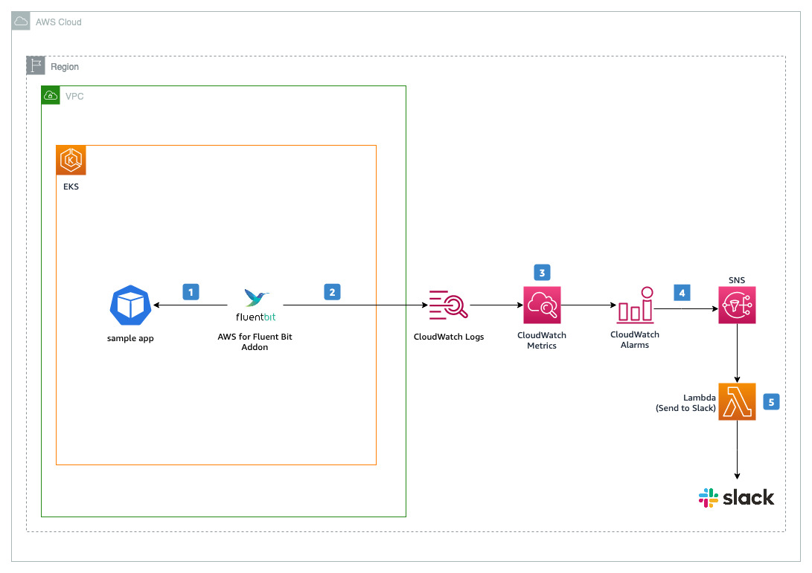
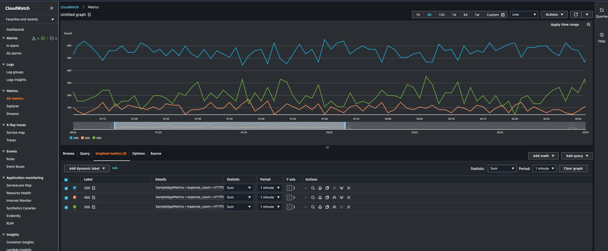

# Using Amazon EKS Blueprints and Open Telemetry to capture errors from Kubernetes applications on Slack

### Introduction

The [Operational Excellence](https://docs.aws.amazon.com/wellarchitected/latest/framework/operational-excellence.html) pillar of [AWS Well-Architected Framework](https://docs.aws.amazon.com/wellarchitected/latest/framework/welcome.html) focusses on the the ability to support development and run workloads effectively, gain insight into their operations, and to continuously improve supporting processes and procedures to deliver business value. Capturing errors from your Kubernetes applications and effectively alerting those errors are very important to improve business processes to constantly deliver real business value to your end users. Efficient and effective management of these operational events is required to achieve operational excellence.

In this blog we will using [Amazon EKS Blueprints](https://github.com/aws-quickstart/cdk-eks-blueprints) as a vehicle to create your Amazon EKS clusters with Day 2 operational tooling such as [AWS Distro for Open Telemetry](https://aws.amazon.com/otel/) (ADOT) and ADOT CloudWatch Collector to capture errors from your Kubernetes application. The solution will then deploy a [AWS Serverless Application Model (SAM)](https://aws.amazon.com/serverless/sam/) template which will generate CloudWatch alarms for errors from your Kubernetes application and invokes an Amazon Lambda function to send real time alerts to [Slack](https://slack.com/). 

### Solution Overview




**Here is a functional flow of this solution:**

1. [AWS Distro for Open Telemetry](https://aws.amazon.com/otel/) (ADOT) Operator manages the life cycle of your ADOT CloudWatch Collector. 
2. ADOT CloudWatch Collector scrapes metrics from application and  sends metrics to Amazon CloudWatch.
3. [Amazon CloudWatch custom metric filters](https://docs.aws.amazon.com/AmazonCloudWatch/latest/logs/MonitoringPolicyExamples.html) monitors required events in respective CloudWatch log groups.
4. [CloudWatch Alarm](https://docs.aws.amazon.com/AmazonCloudWatch/latest/monitoring/AlarmThatSendsEmail.html) triggers notification to Amazon SNS when a threshold is breached.
5. Amazon SNS invokes an Amazon Lambda function which in-turn sends CloudWatch alarm notifications to Slack.

#### Prerequisites

Install the following utilities on a Linux based host machine, which can be an [Amazon EC2](https://aws.amazon.com/ec2/) instance, [Cloud9](https://docs.aws.amazon.com/cloud9/latest/user-guide/setting-up.html) instance or a local machine with access to your AWS account:

* [AWS CLI version 2](https://docs.aws.amazon.com/cli/latest/userguide/getting-started-install.html#getting-started-install-instructions) to interact with AWS services using CLI commands
* [Node.js](https://nodejs.org/en/download/current/) (v16.0.0 or later) and [npm](https://docs.npmjs.com/downloading-and-installing-node-js-and-npm) (8.10.0 or later)
* [AWS CDK v2.62.0](https://docs.aws.amazon.com/cdk/v2/guide/getting_started.html#getting_started_install)or later to build and deploy cloud infrastructure and Kubernetes resources programmatically
* [AWS SAM CLI](https://docs.aws.amazon.com/serverless-application-model/latest/developerguide/install-sam-cli.html) to deploy AWS Lambda function
* [Docker CLI](https://docs.docker.com/get-docker/) to build docker images
* [Kubectl](https://docs.aws.amazon.com/eks/latest/userguide/install-kubectl.html) to communicate with the Kubernetes API server
* [Git](https://git-scm.com/download/linux) to clone required source repository from GitHub

Let’s start by setting a few environment variables:

```
export CAP_ACCOUNT_ID=$(aws sts get-caller-identity \
--query 'Account' --output text)
export CAP_CLUSTER_REGION="us-east-2"
export CAP_CLUSTER_NAME="demo-cluster"
export CAP_FUNCTION_NAME="cloudwatch-to-slack"
```

Clone the sample repository which contains the code for our solution :

```
git clone https://github.com/aws-samples/containers-blog-maelstrom.git
cd ./containers-blog-maelstrom/aws-cdk-eks-app-alarms-to-slack
```

#### Bootstrap the Environment

In this solution we will be using [Amazon EKS CDK Blueprints](https://github.com/aws-quickstart/cdk-eks-blueprints/tree/main/docs) to provision our Amazon EKS cluster. The first step to any [CDK](https://aws.amazon.com/cdk/) deployment is bootstrapping the environment. `cdk bootstrap` is a tool in the AWS CDK command-line interface ([AWS CLI)](https://docs.aws.amazon.com/cli/?id=docs_gateway) responsible for preparing the environment (i.e., a combination of AWS account and AWS Region) with resources required by CDK to perform deployments into that environment. If you already use [CDK](https://aws.amazon.com/cdk/) in a region, you don’t need to repeat the bootstrapping process. 

Lets run the below script to bootstrap your environment and install all node dependencies required for deploying the solution:

```
sh ./bootstrap-env.sh
```

Please navigate to `bin/cluster-blueprint.ts` in the cloned repo to check on the [Amazon EKS CDK Blueprints](https://github.com/aws-quickstart/cdk-eks-blueprints/tree/main/docs) stack which will deploy EKS Cluster with day 2 operational [add-ons](https://aws-quickstart.github.io/cdk-eks-blueprints/addons/) required to run our solution. Please see the below `bin/cluster-blueprint.ts` snippet showing our EKS CDK Blueprints stack :

```
import 'source-map-support/register';
import * as cdk from 'aws-cdk-lib';
import * as blueprints from '@aws-quickstart/eks-blueprints';

const app = new cdk.App();

const account = process.env.CAP_ACCOUNT_ID! || process.env.CDK_DEFAULT_ACCOUNT!;
const region = process.env.CAP_CLUSTER_REGION! || process.env.CDK_DEFAULT_REGION!;
const clusterName = process.env.CAP_CLUSTER_NAME!;

const addOns: Array<blueprints.ClusterAddOn> = [
    new blueprints.addons.AwsLoadBalancerControllerAddOn(),
    new blueprints.addons.VpcCniAddOn(),
    new blueprints.addons.CoreDnsAddOn(),
    new blueprints.addons.KubeProxyAddOn(),
    new blueprints.addons.CertManagerAddOn(),
    new blueprints.addons.AdotCollectorAddOn(),
    new blueprints.addons.CloudWatchAdotAddOn({deploymentMode: blueprints.addons.cloudWatchDeploymentMode.DEPLOYMENT,
        metricsNameSelectors: ['apiserver_request_.*', 'container_memory_.*', 'container_threads', 'otelcol_process_.*', 'ho11y*'],
        podLabelRegex: 'frontend|downstream(.*)'}
    )
];

const stack = blueprints.EksBlueprint.builder()
    .account(account)
    .region(region)
    .addOns(...addOns)
    .build(app, clusterName);
```

Next, run the `cdk list` command which lists name of stack that will be created.

```
cdk list
```

If you are interested in knowing list of resources that will be created by this stack, you can view them using `cdk diff` command. 

#### Create the clusters

Run below command to deploy the Amazon EKS cluster with day 2 operational [add-ons](https://aws-quickstart.github.io/cdk-eks-blueprints/addons/) required to run our solution. 

```
cdk deploy "*" --require-approval never
```

Deployment will take approximately 20-30 minutes to complete. Upon completion, you will have a fully functioning EKS cluster deployed in your account. 


Please copy and run the `aws eks update-kubeconfig...` command as shown in the above screenshot to gain access to your Amazon EKS cluster using `kubectl`.

#### AWS Distro for OpenTelemetry (ADOT) Operator

[AWS Distro for OpenTelemetry (ADOT)](https://aws-otel.github.io/docs/introduction) is a production ready, secure, AWS-supported distribution OpenTelemetry project. With ADOT, you can instrument your application once and send correlated metrics and traces to many monitoring solutions including [Amazon CloudWatch](https://aws.amazon.com/cloudwatch/). You can deploy ADOT in EKS as an add-on which in-turn deploys [ADOT Operator](https://aws-otel.github.io/docs/getting-started/adot-eks-add-on#the-adot-operator-and-adot-collector). ADOT Operator manages the lifecyle of your [ADOT Collector](https://aws-otel.github.io/docs/getting-started/adot-eks-add-on#the-adot-operator-and-adot-collector), a collection agent which receives, processes, and exports telemetry data. With the deployment in the previous step, ADOT Operator is deployed as an add-on ([AdotCollectorAddOn](https://aws-quickstart.github.io/cdk-eks-blueprints/addons/adot-addon/)) in the namespace `opentelemetry-operator-system`. 

Run the below command to check the running `opentelemetry-operator-controller-manager` pods :

```
kubectl get po -n opentelemetry-operator-system \
-l app.kubernetes.io/name=opentelemetry-operator

NAME                                                         READY   STATUS    RESTARTS   AGE
opentelemetry-operator-controller-manager-76b94f4756-lgq69   2/2     Running   0          7m36s
```

#### ADOT CloudWatch Collector

To send application metrics and traces to Amazon CloudWatch, you can use [Amazon CloudWatch ADOT Collector add-on](https://aws-quickstart.github.io/cdk-eks-blueprints/addons/cloudwatch-adot-addon/). You can deploy this add-on as Deployment, Daemonset, StatefulSet or Sidecar as per your deployment strategy. Amazon CloudWatch ADOT Collector blueprints add-on is deployed with filters on specific metrics and pod labels using `metricsNameSelectors` and `podLabelRegex`. 

Run the below command to validate installation of CloudWatch ADOT Collector add-on and this shows the list of collector pods :

```
kubectl get po -n default \
-l app.kubernetes.io/component=opentelemetry-collector

NAME                                        READY   STATUS    RESTARTS   AGE
otel-collector-cloudwatch-collector-x5djc   1/1     Running   0          7m43s
```

#### Deploy Sample Application (ho11y)

Next, let us deploy a sample application called [ho11y](https://github.com/aws-observability/aws-o11y-recipes/tree/main/sandbox/ho11y#overview), a synthetic signal generator that lets you test observability solutions for microservices. It emits logs, metrics, and traces in a configurable manner. For more information, see the [AWS O11y Receipes respository](https://github.com/aws-observability/aws-o11y-recipes/tree/main/sandbox/ho11y). 

Run the below command to deploy ho11y application:

```
kubectl apply -f ./templates/ho11y-app.yaml
```

Once `ho11y` app is deployed successfully, run the the below command to list all pods in `ho11y` namespace on your EKS cluster.

```
kubectl get po -n ho11y

NAME                           READY   STATUS    RESTARTS   AGE
downstream0-5d48fd95b6-xl28g   1/1     Running   0          23s
downstream1-79ccd4b64c-fbxnv   1/1     Running   0          23s
frontend-7758b97475-lvfqk      1/1     Running   0          24s
```

#### Create CloudWatch Metrics

You can convert log data into numerical CloudWatch metrics using [metric filters](https://docs.aws.amazon.com/AmazonCloudWatch/latest/logs/MonitoringLogData.html). Metric filters allow you to configure rules to extract metric data from log events. `ho11y` app exposes number of metrics via `/metrics `endpoint. One such [request based metric](https://github.com/aws-observability/aws-o11y-recipes/tree/main/sandbox/ho11y#request-based-metrics) `ho11y_total` is used in the below `put-metric-filter` command to create metric filter with dimensions such as `namespace` and `http_status_code`.

Lets run the below commands to create metric filter:

```
aws logs put-metric-filter --region ${CAP_CLUSTER_REGION} \
--log-group-name /aws/containerinsights/${CAP_CLUSTER_NAME}/prometheus \
--cli-input-json file://templates/ho11y-metric-filter.json
```

#### Send CloudWatch alarms to Slack

Next, lets configure our solution to send CloudWatch notification alarms to [Slack](https://slack.com/). [Amazon CloudWatch alarms](https://docs.aws.amazon.com/AmazonCloudWatch/latest/monitoring/AlarmThatSendsEmail.html)can be created for required metric and one or more actions can be triggered based on metric value relative to a threshold over a duration. One such action is to send notification to [Simple Notification Service (SNS)](https://aws.amazon.com/sns/). We will then use Lambda function to process this notification and forward to Slack using incoming webhook. 

**Create Slack Incoming Webhook**

Slack allows you to send messages from other applications using incoming webhook. Please refer to [sending messages using incoming webhooks](https://api.slack.com/messaging/webhooks) for more details. We will use this incoming webhook to send required CloudWatch alarms to Slack channel. Follow below steps to configure incoming webhook in Slack:

1. Create or pick a Slack channel to send CloudWatch alarms notifications.
2. Go to `https://<your-team-domain>.slack.com/services/new` and search for "Incoming WebHooks", select and click "Add to Slack".
3. Under Post to Channel, choose the Slack channel where messages will be sent and click "Add Incoming WebHooks Integration".
4. Copy webhook URL from the setup instructions and save it. This URL will be used in Lambda function.

**Create KMS Key**

In order to increase security posture of incoming webhook URL, we will now encrypt it using [AWS KMS keys](https://docs.aws.amazon.com/kms/latest/developerguide/concepts.html#kms_keys). Create KMS Key and key alias using below mentioned commands:

```
CAP_KMS_KEY_ID=$(aws kms create-key --region ${CAP_CLUSTER_REGION} \
--description "Encryption Key for lambda function ${CAP_FUNCTION_NAME}" \
--key-spec SYMMETRIC_DEFAULT --key-usage ENCRYPT_DECRYPT \
--query KeyMetadata.KeyId --output text)

aws kms create-alias --region ${CAP_CLUSTER_REGION} \
--alias-name alias/${CAP_FUNCTION_NAME}-key --target-key-id $CAP_KMS_KEY_ID

```

**Create an Amazon Lambda function**

As next step, we will create Lambda function to send CloudWatch alarm notifications to Slack using [AWS Serverless Application Model (SAM)](https://aws.amazon.com/serverless/sam/). AWS SAM uses AWS CloudFormation as the underlying deployment mechanism. We will create following resources using AWS SAM template:

1. An Amazon SNS topic to which notifications will be published by CloudWatch alarm.
2. A Lambda execution role to grant function permission with basic access and to decrypt using KMS Key.
3. A Lambda function to send notifications to Slack using incoming webhook URL.
4. Permission for SNS to trigger Lambda function.

The script `deploy-sam-app.sh`  intakes the following two input values to deploy SAM template.

1. Slack incoming webhook URL which you created previously. 
2. Slack channel name (you selected previously) to which notifications need to be sent

 `deploy-sam-app.sh` script, Slack incoming webhook URL will be encrypted (client-side) using KMS Key to specific encryption context. Lambda function will decrypt using same encryption context. Lambda execution role is provided with fine-grained access to use KMS Key only for the specific encryption context. 
Run the below command to deploy SAM template.

```
sh ./deploy-sam-app.sh
```

**Test Lambda function**

Next, let us validate our Lambda function by pushing a test event using the payload available at `templates/test-event.json`. Run the command given below to push a test event:

```
aws lambda invoke --region ${CAP_CLUSTER_REGION} \
--function-name ${CAP_FUNCTION_NAME} \
--log-type Tail \
--query LogResult --output text \
--payload $(cat templates/test-event.json | base64 -w 0) -` \
| base64 -d`
```

Successful run will post test message to Slack channel and have command output as shown below :





```
[INFO]  2023-02-17T22:48:12.041Z        a07549ea-3dcf-4131-9f15-b676f461bbbd    Message posted to ho11y-cloudwatch-alarms
END RequestId: a07549ea-3dcf-4131-9f15-b676f461bbbd
REPORT RequestId: a07549ea-3dcf-4131-9f15-b676f461bbbd  Duration: 292.01 ms     Billed Duration: 293 ms Memory Size: 128 MB     Max Memory Used: 69 MB  Init Duration: 399.38 ms
```


#### Create CloudWatch Alarms

Next, we will create CloudWatch alarm on a metric to create and send notifications to SNS topic. Below mentioned command creates CloudWatch alarm that monitors for http_status_code=400 and when the number of errors is above 15 in last 5 minutes, then a notification is sent to SNS topic.

```
SNS_TOPIC=$(aws cloudformation --region ${CAP_CLUSTER_REGION} describe-stacks --stack-name ${CAP_FUNCTION_NAME}-app --query 'Stacks[0].Outputs[?OutputKey==`CloudwatchToSlackTopicArn`].OutputValue' --output text)

aws cloudwatch put-metric-alarm --region ${CAP_CLUSTER_REGION} \
--alarm-actions ${SNS_TOPIC} \
--cli-input-json file://templates/ho11y-400-alarm.json

aws cloudwatch describe-alarms --region ${CAP_CLUSTER_REGION} \
--alarm-names "400 errors from ho11y app"

```

#### Generate Traffic to ho11y application

Generate traffic to ho11y application using below mentioned command which in-turn generates metrics. Run this script in a separate terminal :

```
frontend_pod=`kubectl get pod -n ho11y --no-headers -l app=frontend -o jsonpath='{.items[*].metadata.name}'`
loop_counter=0
while [ $loop_counter -le 5000 ] ;
do
    echo $loop_counter;
    kubectl exec -n ho11y -it $frontend_pod -- curl frontend.ho11y.svc.cluster.local;
    loop_counter=$[$loop_counter+1];
done
```

Let this run for 10 minutes and check CloudWatch alarm status. If there is a breach in threshold, you will get notification sent to Slack channel as shown below. 


### Cleanup

Run `cleanup.sh` script to clean up all resources deployed as part of this post.

```
sh ./cleanup.sh
```

### Conclusion

In this blog we demonstrated a solution to capture errors from your Kubernetes applications to validate your understanding of operational success of your Kubernetes applications and how it changes over time. We used [Amazon EKS Blueprints](https://github.com/aws-quickstart/cdk-eks-blueprints) to create your Amazon EKS clusters with Day 2 operational tooling such as [AWS Distro for Open Telemetry](https://aws.amazon.com/otel/) (ADOT) and ADOT CloudWatch Collector. We then deployed a [AWS Serverless Application Model (SAM)](https://aws.amazon.com/serverless/sam/) template to generate CloudWatch alarms and invoke an Amazon Lambda function to send real time alerts to [Slack](https://slack.com/) for errors from your Kubernetes application. We would recommend you to try this solution and for further learning please check our [AWS Observability Best practices](https://aws-observability.github.io/observability-best-practices/) guide. Additionally, you can get hands-on experience with the AWS services using the One Observability Workshop. 


### Elamaran Shanmugam

Elamaran (Ela) Shanmugam is a Sr. Container Specialist Solutions Architect with Amazon Web Services. Ela is a Container, Observability and Multi-Account Architecture SME and helps AWS partners and customers to design and build scalable, secure and optimized container workloads on AWS. His passion is building and automating Infrastructure to allow customers to focus more on their business. He is based out of Tampa, Florida and you can reach him on twitter @IamElaShan


### Re Alvarez Parmar

In his role as Containers Specialist Solutions Architect at Amazon Web Services. Re advises engineering teams with modernizing and building distributed services in the cloud. Prior to joining AWS, he spent over 15 years as Enterprise and Software Architect. He is based out of Seattle. You can connect with him on LinkedIn linkedin.com/in/realvarez/


### Prakash Srinivasan

Prakash is a Solutions Architect with Amazon Web Services. He is a passionate builder and helps customers to modernize their applications and accelerate their Cloud journey to get the best out of Cloud for their business. In his spare time, he enjoys watching movies and spend more time with family. He is based out of Denver, Colorado and you can connect with him on Linkedin at [linkedin.com/in/prakash-s](https://www.linkedin.com/in/prakash-s/)

